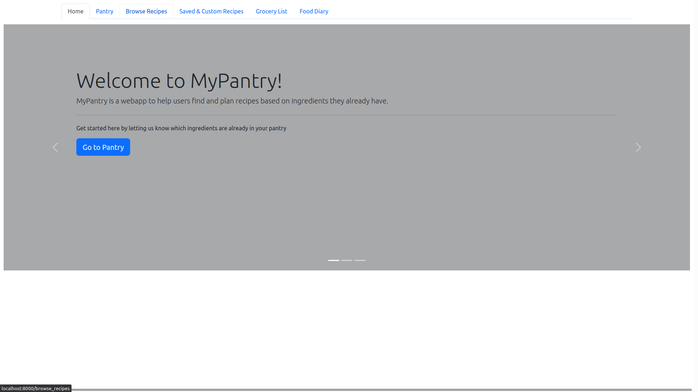
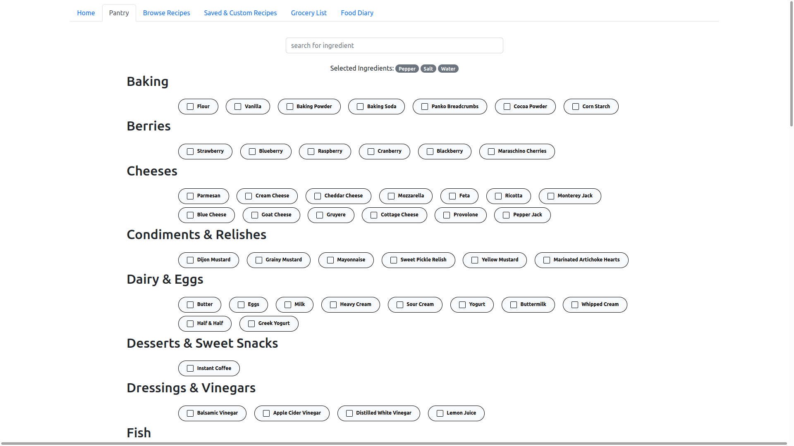
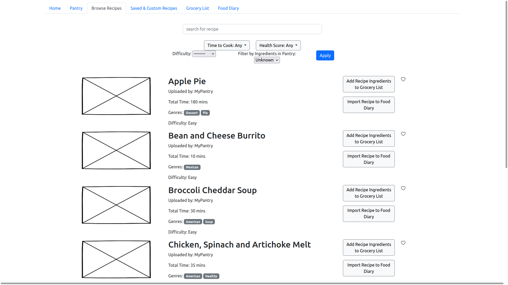

# MyPantry Prototype

The MyPantry prototype used in the usability tests is a Django-based web application that was created by the UX team. We chose to use Django when making our prototype because we were not satisfied by the limitations on our insights that an AdobeXD prototype would have imposed. We believed that the best insights to be gained would be from user interactions with a "simulation" of the product.

For the design of our prototype, we omitted the extra step of having a user login to an account. We did this because it would have been more difficult to implement a prototype that could handle unique users, and because no useful usability insights were to be gained by having a user login as they are used exhaustively on most web applications.

We also recieved a lot of criticism on the names of tabs in the navbar. This could be because of the way the tasks were worded, but many users were confused about the differences between some of the tabs as well as what each tab meant individually.

## Home Page

One of the largest improvements that can be made on this screen is separating the options in the carousel to separate cards. Most users did not even read the options on the carousel, or notice that it was a carousel. Since these shortcuts are useful for new users, it would be better to have them as separate options for new users to quickly glance over.

## Pantry 

The biggest complaint about this page was that the user was required to manually enter data. Some suggestions include automatically adding the ingredient by pressing enter instead of clicking the checkbox. This would help increase efficiency when entering large amounts of data.

## Browse Recipes

## Saved and Custom Recipes

## Grocery List

## Food Diary