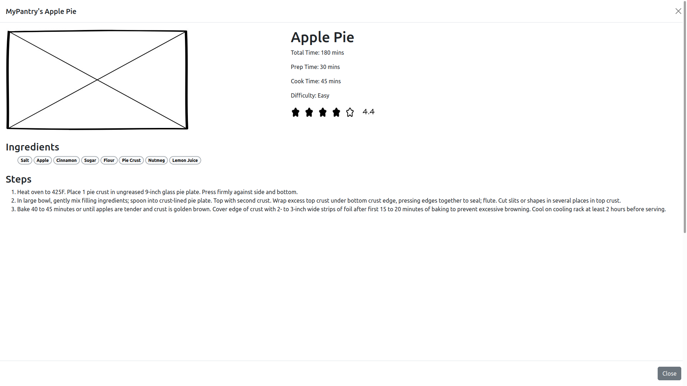
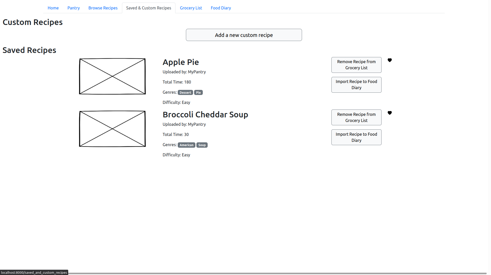
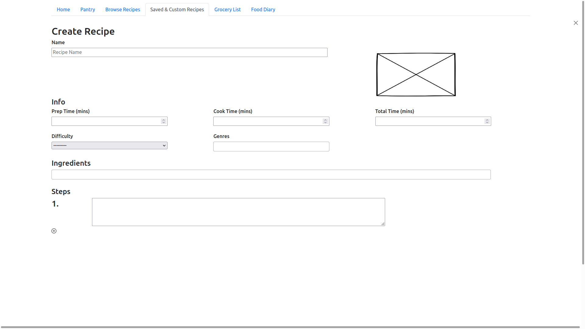
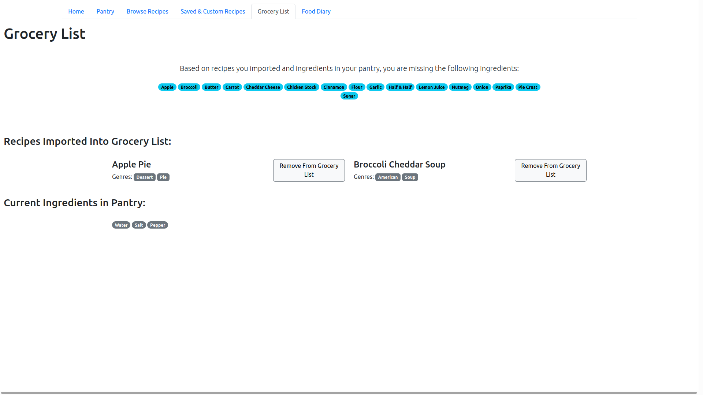
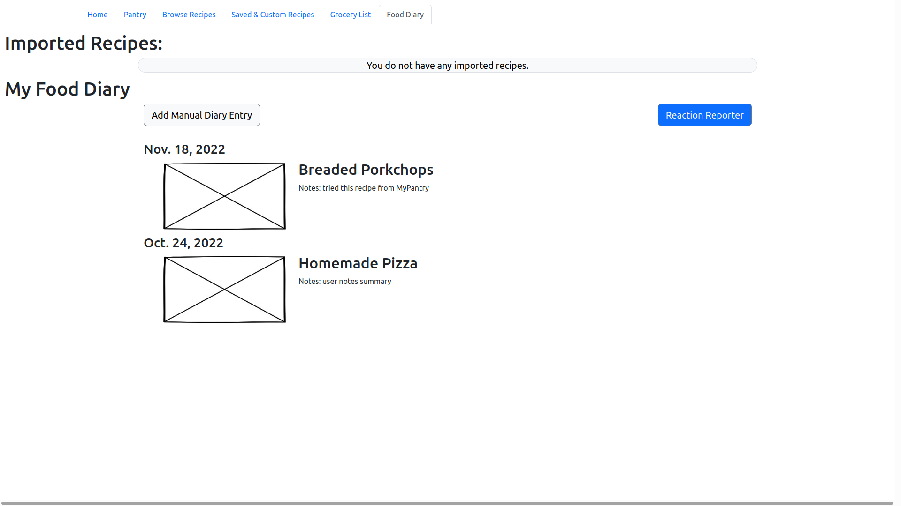

# MyPantry Prototype

The MyPantry prototype used in the usability tests is a Django-based web application that was created by the UX team. We chose to use Django when making our prototype because we were not satisfied by the limitations on our insights that an AdobeXD prototype would have imposed. We believed that the best insights to be gained would be from user interactions with a "simulation" of the product.

For the design of our prototype, we omitted the extra step of having a user login to an account. We did this because it would have been more difficult to implement a prototype that could handle unique users, and because no useful usability insights were to be gained by having a user login as they are used exhaustively on most web applications.

We also recieved a lot of criticism on the names of tabs in the navbar. This could be because of the way the tasks were worded, but many users were confused about the differences between some of the tabs as well as what each tab meant individually.

## Home Page

One of the largest improvements that can be made on this screen is separating the options in the carousel to separate cards. Most users did not even read the options on the carousel, or notice that it was a carousel. Since these shortcuts are useful for new users, it would be better to have them as separate options for new users to quickly glance over.

## Pantry 

The biggest complaint about this page was that the user was required to manually enter data. Some suggestions include automatically adding the ingredient by pressing enter instead of clicking the checkbox. This would help increase efficiency when entering large amounts of data.

## Browse Recipes

A lot of good feedback was recieved about the filters on this page. Clarity of the filters was questionable, as users were confused on whether the recipes were already filtered by the ingredients they had in their pantry. Part of this is due to a limitation of the prototype, as the dropdown for filtering recipes by ingredients should be a binary yes/no but for some reason renders as 3 options with the default being "unknown."

## Recipe Card

Most users believed the overall layout of the recipe to be appealing, but there was complaints about there not being any quantities. This was more a limitation of the prototype, but one highly requested feature was unit conversion for quantities. Another good suggestion was the ability to favorite and import the recipe to the grocery list within the recipe card, which is something we completely overlooked.

## Saved and Custom Recipes

Not much feedback was given about this page. Users liked that they could save and make their own recipes, but that was about it.

## Recipe Creation Form

There are a few problems with our recipe creation form, one is that the button to add another step was too small, but this was more a limitation of the prototype rather than a design decision we actually made. A larger button is present in our wireframes. The same could be said for the position of the submit button, for some reason it was rendered lower on the page than where we actually would have liked it. 

Overall, people loved the way that ingredients were selected. A description for the recipe was a requested feature, along with the ability to leave out certain information such as total time, etc. The ability to create your own genre seems interesting, but probably will turn out to be difficult to implement effectively (specifically when regarding the ability to filter recipes by genre). Another requested feature was the ability to import a recipe by using a url and scraping the url for the recipe, or the ability to copy/paste all the steps for the entire recipe.

## Grocery List

Overall, users loved the idea of the grocery list. There was some confusion over its intended purpose, further emphasizing the need for a "getting started" help page. Users liked that they were immediately shown the ingredients they were missing, and also commented that they would like some way to export this list to a checkbox-style format in which checking off the ingredient would add it to their pantry or, alternatively, a button that would automatically import all missing ingredients into their pantry.

## Food Diary

By far the page that recieved the most feedback was the food diary. As discovered in phase II, a lot of users did love the idea of the food diary, but because of its recent addition, we weren't able to flesh out its design or how it should work. This resulted in an abudance of comments on how users believed it should work that varied drastically from how we originally envisioned it.

Moving forward, the food diary will be implemented as a timeline, where users add entries to the timeline saying that they either ate a specific recipe, or how they are currently feeling. It was also suggested that a program could analyze what you've eaten and how you felt, and determine ingredients or categories of ingredients you should try avoiding in order to improve your digestive health. 